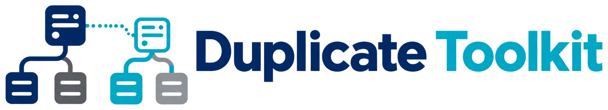

<p align="center">
    
</p>

# DuplicateToolkit

Duplicate an Eloquent record and everything under it — deciding, per relation, whether to copy it, point at the original, or leave it alone.

[](https://packagist.org/packages/gabrielesbaiz/duplicate-toolkit)
[](composer.json)
[](composer.json)
[](https://packagist.org/packages/gabrielesbaiz/duplicate-toolkit)
[](https://github.com/gabrielesbaiz/duplicate-toolkit/stargazers)
[](https://github.com/sponsors/gabrielesbaiz)

### 📖 [Read the documentation →](https://gabrielesbaiz.github.io/duplicate-toolkit/)

Every option, a terminal and an engineering plate that draw your model's relation
tree in step, and a guide that covers each strategy end to end.

> [!CAUTION]
> **Upgrading from 1.x?** Read [UPGRADE.md](UPGRADE.md) first. 1.x leaked relations
> between model classes in the same request, discovered relations by reading your
> source files and invoking every public method, and crashed on `morphToMany`.
> `php artisan duplicate-toolkit:upgrade` rewrites most of it; two cases need a
> human.

> [!IMPORTANT]
> A ⭐ costs you nothing and helps other developers find this package.
> [Sponsoring](https://github.com/sponsors/gabrielesbaiz) keeps it compatible
> with every new Laravel release.

## What it does

Eloquent ships `replicate()`. It copies one row's attributes and hands back an
unsaved model. If that is all you need, use it — one method call, no dependency.
This package exists for the rows *underneath* the one you copied:

- **Deep duplication** of `hasOne`, `hasMany`, `morphOne`, `morphMany`, `belongsToMany` and `morphToMany`, to any depth, with cycle detection.
- **Three strategies per relation** — copy it, reference the originals, skip it — set on the model, at the call site, or with dot notation several levels down.
- **Overrides applied before the insert**, so renaming a copy costs one write rather than two, and does not fire the events `quietly()` just suppressed.
- **An old key → new key map** for every record created, so nothing downstream has to match duplicated rows by name.
- **A dry run** that performs every write and rolls back, and **four Artisan commands**, one of which draws your model's relation tree.

Relations are discovered by reflecting on return types — no source parsing, no
model methods invoked, no cache shared between classes.

## Requirements

- PHP 8.3+
- Laravel 12 or 13

## Installation

```bash
composer require gabrielesbaiz/duplicate-toolkit

php artisan vendor:publish --tag=duplicate-toolkit-config

php artisan duplicate-toolkit:relations "App\Models\Product" --depth=2
```

Add the `HasDuplicates` trait to a model and call `$model->duplicate()`. The
service provider is auto-discovered — no migrations, no tables, no assets — and
publishing the config is optional, since the defaults duplicate correctly
untouched.

**[Full installation guide →](https://gabrielesbaiz.github.io/duplicate-toolkit/#/install)**

## Artisan commands

| Command | Purpose |
|---|---|
| `duplicate-toolkit:relations {model?}` | Print the relation tree and the strategy that applies to each relation. |
| `duplicate-toolkit:duplicate {model?} {id?}` | Duplicate a record, interactively or from flags. `--dry-run` plans it. |
| `duplicate-toolkit:make-options {model?}` | Generate a typed `duplicateOptions()` from a relation picker. |
| `duplicate-toolkit:upgrade {path}` | Rewrite 1.x usages to the 2.0 API. |

Every flag is on the
[commands page](https://gabrielesbaiz.github.io/duplicate-toolkit/#/commands).

## Documentation

| | |
|---|---|
| [Documentation site](https://gabrielesbaiz.github.io/duplicate-toolkit/) | Everything: install, configure, operate. |
| [Relation strategies](https://gabrielesbaiz.github.io/duplicate-toolkit/#/strategies) | Copy, reference, skip — and the defaults per relation type. |
| [Configuration](https://gabrielesbaiz.github.io/duplicate-toolkit/#/config) | Every key, and its per-duplication equivalent. |
| [Troubleshooting](https://gabrielesbaiz.github.io/duplicate-toolkit/#/trouble) | The failures people actually hit. |
| [UPGRADE.md](UPGRADE.md) | Upgrading from 1.x. Read before you start. |
| [CHANGELOG.md](CHANGELOG.md) | What changed, and when. |

## Testing

```bash
composer test        # Pest
composer analyse     # PHPStan, level max
composer format      # Pint
composer rector-dry  # Rector
```

CI runs the suite on PHP 8.3 and 8.4 × Laravel 12 and 13, on both
`prefer-lowest` and `prefer-stable`.

## Contributing

Thank you for considering contributing. The guide is in
[CONTRIBUTING.md](CONTRIBUTING.md).

## Security vulnerabilities

Please review [SECURITY.md](SECURITY.md) for reporting a vulnerability. Please
do not open a public issue.

## Credits

Written and maintained by [Gabriele Sbaiz](https://github.com/gabrielesbaiz).

The 1.x line was a fork of
[neurony/laravel-duplicate](https://github.com/neurony/laravel-duplicate) by
Neurony Solutions, whose design informed this one. This package builds on
Laravel and
[spatie/laravel-package-tools](https://github.com/spatie/laravel-package-tools).

## Support this package

If it is useful to you:

- ⭐ **Star the repo.** Free, thirty seconds, and it is the first signal other developers look at.
- ❤️ **[Become a sponsor](https://github.com/sponsors/gabrielesbaiz).** From $5 a month.
- 🐛 **Open a good issue.** A clear reproduction is worth more than you think.
- 🗣️ **Tell another Laravel developer.** Word of mouth is how packages survive.

[](https://github.com/sponsors/gabrielesbaiz)

## Disclaimer

This package is provided **as is**, without warranty of any kind, express or
implied, including but not limited to the warranties of merchantability,
fitness for a particular purpose, title and non-infringement. To the fullest
extent permitted by applicable law, in no event shall the authors, copyright
holders or contributors be liable for any claim, damages or other liability —
whether in an action of contract, tort or otherwise — arising from, out of or in
connection with this package or its use, including without limitation any
direct, indirect, incidental, special, exemplary, consequential or punitive
damages, loss of data, loss of profits, business interruption, or corruption of
records.

This package writes to your database. It creates rows, copies relations and,
when you ask it to, attaches existing records to new ones. Whoever deploys it is
responsible for deciding whether the result is correct for their schema. That
responsibility includes, and is not limited to, reviewing what each relation
strategy will do before enabling it, running `preview()` or `--dry-run` against
production-shaped data, keeping backups, understanding that duplicated rows may
trigger observers, listeners, queued jobs and search indexing unless
`quietly()` is used, and reading the code yourself before pointing it at data
you cannot afford to lose. Nothing here constitutes legal or compliance advice.

Use of this package is entirely at your own risk.

## License

MIT. See [LICENSE.md](LICENSE.md). The MIT licence's warranty disclaimer and
limitation of liability apply in full, alongside the disclaimer above.
